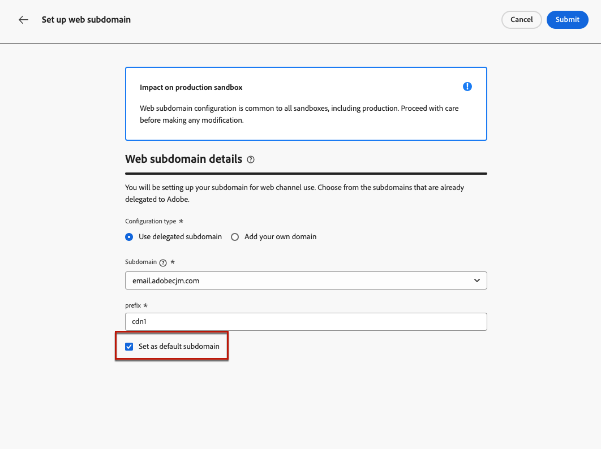
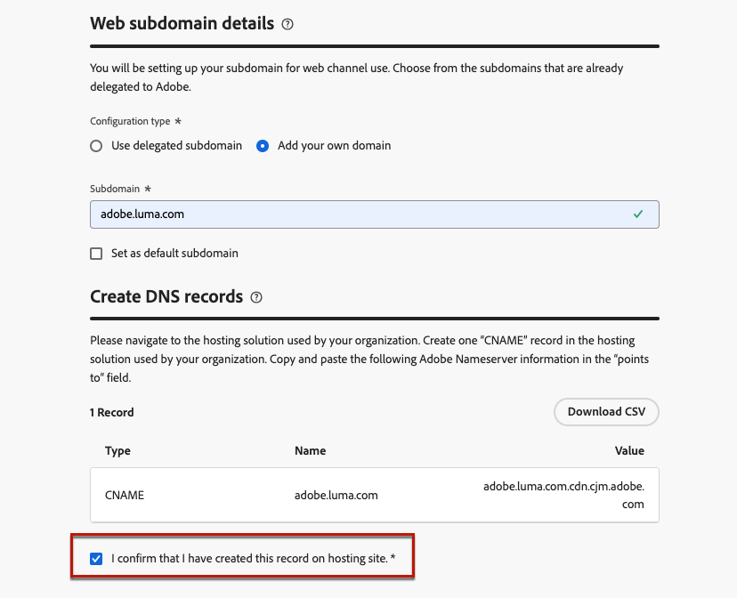

# Configuración de subdominios web {#web-subdomains}

>[!BEGINSHADEBOX]

**En esta página:** Obtenga información sobre cómo configurar subdominios web en Adobe Journey Optimizer mediante un subdominio ya delegado a Adobe o configurando uno nuevo para publicar contenido de recursos para sus experiencias web.

>[!ENDSHADEBOX]

>[!CONTEXTUALHELP]
>id="ajo_admin_subdomain_web_header"
>title="Delegación de un subdominio web"
>abstract="Se configurará el subdominio para el uso del canal web. Puede utilizar un subdominio que ya esté delegado en Adobe o configurar otro subdominio."

>[!CONTEXTUALHELP]
>id="ajo_admin_subdomain_web"
>title="Delegación de un subdominio web"
>abstract="Si añade contenido procedente de Adobe Experience Manager Assets a sus experiencias web, debe configurar el subdominio que se utilizará para publicar este contenido. Seleccione entre los subdominios ya delegados a Adobe o configure un nuevo subdominio."

>[!CONTEXTUALHELP]
>id="ajo_admin_subdomain_web_default"
>title="Definición de un subdominio web"
>abstract="Seleccione un subdominio de la lista de subdominios delegados en Adobe. Puede establecer este subdominio web como el predeterminado, pero solo se puede utilizar un subdominio predeterminado a la vez."

## Introducción a los subdominios web {#gs-web-subdomains}

Al crear experiencias web, si agrega contenido proveniente de la biblioteca [Adobe Experience Manager Assets](../integrations/assets.md), debe configurar el subdominio que se utilizará para publicar este contenido.

Puede utilizar un subdominio que ya se haya delegado a Adobe o configurar otro. Obtenga más información acerca de la delegación de subdominios a Adobe en [esta sección](../configuration/delegate-subdomain.md).

La configuración del subdominio web es **común a todos los entornos**. Por lo tanto:

* Para acceder y editar subdominios web, debe tener el permiso **[!UICONTROL Administrar subdominios web]** en la zona protegida de producción.

* Cualquier modificación en un subdominio web también afectará a los entornos limitados de producción.

Puede crear varios subdominios web, pero solo se utilizará el subdominio **default**. Puede cambiar el subdominio web predeterminado, pero solo se puede utilizar uno a la vez.

## Acceso y administración de subdominios web {#access-web-subdomains}

Para acceder a los subdominios para las experiencias web, siga estos pasos:

1. Vaya al menú **[!UICONTROL Administración]** > **[!UICONTROL Canales]** y, a continuación, seleccione **[!UICONTROL Configuración web]** > **[!UICONTROL Subdominios web]**. Se muestran todos los subdominios configurados con la zona protegida actual.

   

1. Puede filtrar el usuario que delegó cada subdominio o uno el estado de delegación (**[!UICONTROL Borrador]**, **[!UICONTROL Procesamiento]**, **[!UICONTROL Éxito]** o **[!UICONTROL Error]**).

   

1. El distintivo **[!UICONTROL Default]** se muestra junto al subdominio que se usa actualmente como predeterminado. Para cambiar el subdominio predeterminado, seleccione **[!UICONTROL Establecer como predeterminado]** en el botón **[!UICONTROL Más acciones]** situado junto al subdominio deseado.

   

   Puede cambiar el subdominio web predeterminado, pero solo se puede utilizar uno a la vez.

## Usar un subdominio existente {#web-use-existing-subdomain}

Para utilizar un subdominio que ya se haya delegado a Adobe, siga los pasos a continuación:

1. Acceda al menú **[!UICONTROL Administración]** > **[!UICONTROL Canales]** y, a continuación, seleccione **[!UICONTROL Configuración web]** > **[!UICONTROL subdominios web]**.

1. Haga clic en **[!UICONTROL Configurar subdominio]**.

1. Seleccione la opción **[!UICONTROL Usar subdominio delegado]** de la sección **[!UICONTROL Tipo de configuración]** y elija un subdominio delegado de la lista.

   

   >[!NOTE]
   >
   >No puede seleccionar un subdominio que ya se esté utilizando como subdominio web.

1. El prefijo que se mostrará en la URL web se añade automáticamente. No puede cambiarlo.

1. Para establecer este subdominio como predeterminado, seleccione la opción correspondiente.

   

   Solo se usará el subdominio **default**.

1. Haga clic en **[!UICONTROL Enviar]**. El subdominio obtiene el estado **[!UICONTROL Success]**. Está listo para utilizarse para las experiencias web.

   En muy raras ocasiones, la configuración de un subdominio podría fallar. En este caso, puede eliminar el subdominio **[!UICONTROL Failed]** para limpiar la lista con el botón **[!UICONTROL Delete]** del icono **[!UICONTROL Más acciones]**.

## Configuración de un nuevo subdominio {#web-configure-new-subdomain}

>[!CONTEXTUALHELP]
>id="ajo_admin_web_subdomain_dns"
>title="Generar el registro DNS coincidente"
>abstract="Para configurar un nuevo subdominio web, debe copiar la información del servidor de nombres de Adobe que se muestra en la interfaz de Journey Optimizer y pegarla en la solución de alojamiento de dominios para generar el registro DNS coincidente. Una vez realizadas las comprobaciones correctamente, el subdominio está listo para utilizarse para publicar contenido procedente de la biblioteca de Adobe Experience Manager Assets."

De manera predeterminada, [!DNL Journey Optimizer] le permite delegar **hasta 10 subdominios** en total (que abarcan tanto los canales de correo electrónico como los canales web). Sin embargo, según el contrato de licencia, puede delegar hasta 100 subdominios. Póngase en contacto con la persona de contacto de Adobe para obtener más información sobre el número de subdominios a los que tiene derecho.

Para configurar un nuevo subdominio, siga los pasos a continuación:

1. Acceda al menú **[!UICONTROL Administración]** > **[!UICONTROL Canales]** y, a continuación, seleccione **[!UICONTROL Configuración web]** > **[!UICONTROL subdominios web]**.

1. Haga clic en **[!UICONTROL Configurar subdominio]**.

1. Seleccione **[!UICONTROL Agregar su propio dominio]** de la sección **[!UICONTROL Tipo de configuración]**.

1. Especifique el subdominio que desea delegar.

   >[!CAUTION]
   >
   >* No se puede utilizar un subdominio web existente.
   >
   >* No se permiten mayúsculas en los subdominios.

   

   No se permite delegar un subdominio no válido a Adobe. Asegúrese de introducir un subdominio válido que sea propiedad de su organización, como marketing.yourcompany.com.

   Se admiten subdominios de varios niveles (del mismo dominio principal). Por ejemplo, puede utilizar &quot;web.marketing.yourcompany.com&quot;.

1. Para establecer este subdominio como predeterminado, seleccione la opción correspondiente.

   >[!NOTE]
   >
   >Solo se usará el subdominio **default**.

1. Se muestra el registro que se va a colocar en los servidores DNS. Copie este registro o descargue un archivo CSV y, a continuación, vaya a la solución de alojamiento de dominios para generar el registro DNS correspondiente.

1. Asegúrese de que se ha generado un registro DNS en la solución de alojamiento de dominios. Si todo está configurado correctamente, marque la casilla &quot;Confirmo...&quot; y luego haga clic en **[!UICONTROL Enviar]**.

   

   Al configurar un nuevo subdominio web, siempre apunta a un registro CNAME.

1. Una vez enviada la delegación del subdominio, este se muestra en la lista con el estado **[!UICONTROL Procesando]**. Para obtener más información sobre los estados de los subdominios, consulte [esta sección](../configuration/delegate-subdomain.md#access-delegated-subdomains).<!--Same statuses?-->

   Antes de poder usar ese subdominio para enviar mensajes web, debe esperar hasta que Adobe realice las comprobaciones necesarias, que pueden tardar **hasta 4 horas**.

1. Una vez que las comprobaciones son correctas, el subdominio obtiene el estado **[!UICONTROL Success]**. Está listo para utilizarse para crear configuraciones de canal web.

   Tenga en cuenta que el subdominio se marcará como **[!UICONTROL Error]** si no crea el registro de validación en la solución de alojamiento.

<!--
Only a subdomain with the **[!UICONTROL Success]** status can be set as default.
You cannot delete a subdomain with the **[!UICONTROL Processing]** status.
-->

## Anular la delegación de un subdominio {#undelegate-subdomain}

Si desea desdelegar un subdominio web, póngase en contacto con su representante de Adobe con el subdominio que desee desdelegar.

<!--
1. Deactivate all the channel configurations associated with the subdomain. [Learn how](../configuration/channel-surfaces.md#deactivate-a-surface)

1. Stop the active campaigns associated with the subdomains. [Learn how](../campaigns/manage-campaigns.md#stop)

1. Stop the active journeys associated with the subdomains. [Learn how](../building-journeys/end-journey.md#stop-journey)
-->

Si el subdominio web era un [nuevo subdominio delegado](#web-configure-new-subdomain), puede eliminar el registro DNS CNAME que creó para el subdominio web de su solución de alojamiento (pero no elimine el subdominio de correo electrónico original, si lo hubiera).

Una vez que Adobe administra la solicitud, el dominio no delegado ya no se muestra en la página de inventario de subdominios.
