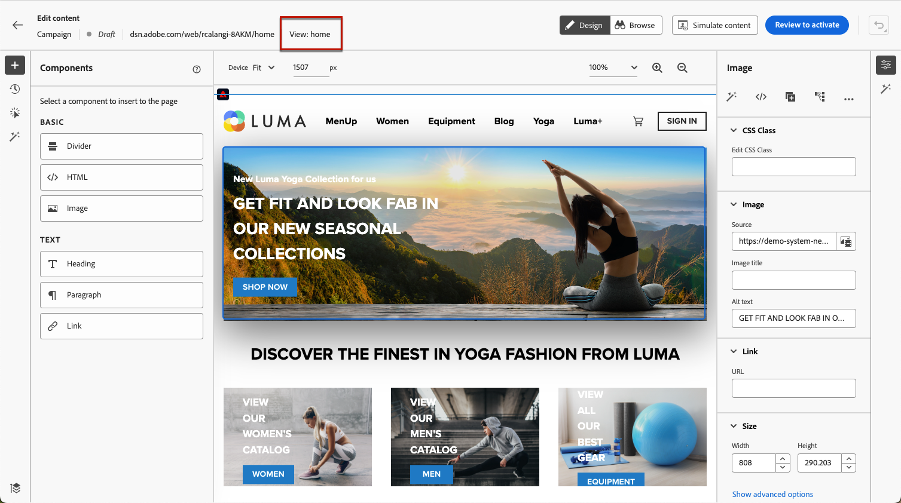
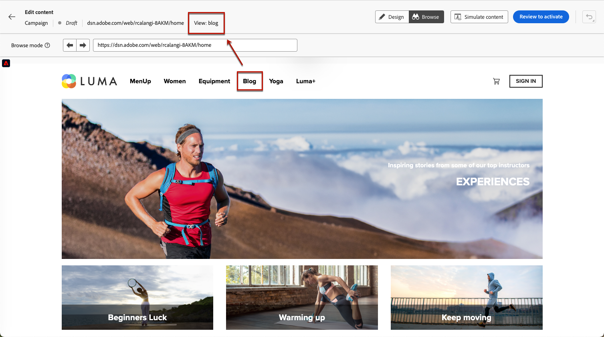
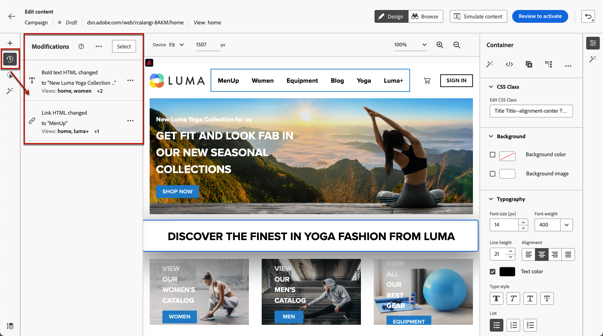
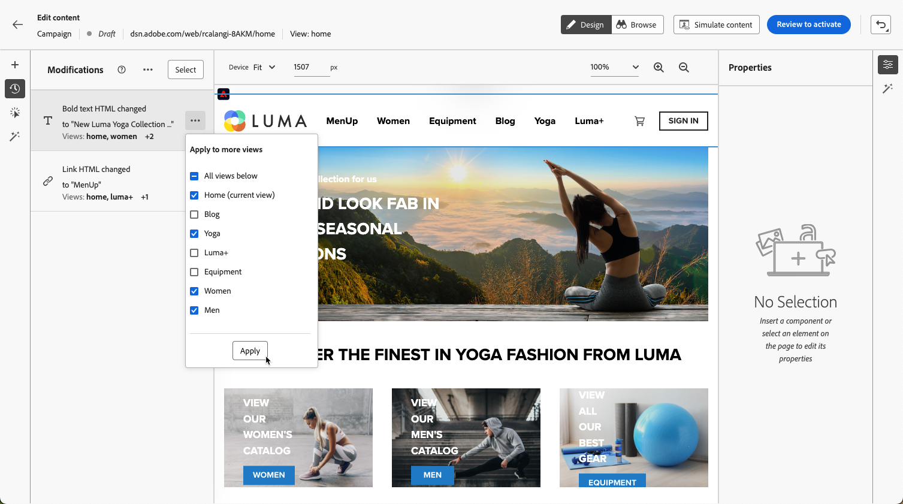

# Creación de aplicaciones de una sola página {#web-author-spas}

## Acerca de las vistas {#about-views}

>[!CONTEXTUALHELP]
>id="ajo_web_designer_modifications_views"
>title="Aplicar cambios a las vistas seleccionadas"
>abstract="Los cambios se aplicarán solamente a las vistas seleccionadas. Las vistas se pueden descubrir utilizando el modo **Examinar** y navegando hasta ellas. ¿No encuentra la vista que busca?"
>additional-url="https://experienceleague.adobe.com/docs/platform-learn/implement-web-sdk/overview.html?lang=es" text="Más información"

Ahora se pueden crear **aplicaciones de una sola página** (SPA) en el editor visual del diseñador web. Esto le permite seleccionar a qué **vistas** específicas desea aplicar las modificaciones de la página web.

[Aprenda a crear aplicaciones de una sola página en este vídeo](#video)

Una vista puede definirse como un sitio completo o un grupo de elementos visuales en un sitio, como la página de inicio, la totalidad de productos del sitio o el marco de preferencias de envío en todas las páginas de cierre de compra.

Se necesita una configuración de desarrollador única para definir las vistas en la implementación de Adobe Experience Platform Web SDK. Esto le permite crear y ejecutar campañas web de Adobe Journey Optimizer en SPA.

## Definición de vistas en la implementación de Web SDK {#define-views}

Las vistas XDM se pueden aprovechar en Adobe [!DNL Journey Optimizer] para que los especialistas en marketing puedan ejecutar campañas de personalización y experimentación web en SPA a través del editor visual web. [Más información](https://experienceleague.adobe.com/docs/experience-platform/edge/personalization/ajo/web-spa-implementation.html?lang=es){target="_blank"}

Para poder tener acceso y crear vistas en la interfaz de usuario de [!DNL Journey Optimizer], asegúrese de seguir los pasos que se indican en [esta sección](https://experienceleague.adobe.com/docs/experience-platform/edge/personalization/ajo/web-spa-implementation.html?lang=es#implement-xdm-views){target="_blank"}.

## Descubra vistas en el diseñador web {#discover-views}

Una vez que la configuración de las SPA se realiza en la implementación de Adobe Experience Platform Web SDK, debe navegar por todas las vistas del sitio web al que desee aplicar las modificaciones. Siga los pasos a continuación.

1. [Cree un recorrido web o una campaña](create-web.md) y acceda al [diseñador web](web-visual-editor.md).

   La vista en la que se encuentra actualmente se muestra en la parte superior izquierda.

   

1. Cambiar al modo **[!UICONTROL Examinar]**. [Más información](web-visual-editor.md#browse-mode)

   

1. Navegue entre las diferentes páginas del sitio web para descubrirlas todas. El nombre de la vista que aparece en la parte superior cambia al pasar por otra página.

   

## Aplicar modificaciones a otras vistas {#apply-modifications-views}

Una vez añadida una modificación mientras se encuentra en una vista específica, puede aplicarla a otras vistas seleccionadas. Siga los pasos a continuación.

>[!CAUTION]
>
>Si no ha descubierto vistas usando el modo **[!UICONTROL Examinar]**, no podrá seleccionarlas para aplicar las modificaciones. [Más información](#discover-views)

1. Seleccione el icono **[!UICONTROL Modificaciones]** para mostrar el panel correspondiente a la izquierda.

   

1. Seleccione cualquier modificación y haga clic en el botón **[!UICONTROL Más acciones]** que está junto a ella. Seleccione **[!UICONTROL Aplicar a más vistas]**.

   

1. Seleccione las vistas a las que desee aplicar los cambios.

   

1. Haga clic en **[!UICONTROL Aplicar]**.

1. Cambie al modo **[!UICONTROL Examinar]** para comprobar que las modificaciones se aplican en las páginas deseadas.

   

## Vídeo práctico{#video}

En este vídeo se explica cómo:

* Descubra vistas de SPA con el modo **[!UICONTROL Examinar]**
* Crear en la vista actual
* Aplicar modificaciones del sitio web a varias vistas o a todas las vistas descubiertas
* Realizar acciones masivas en las modificaciones

>[!VIDEO](https://video.tv.adobe.com/v/3446888/?captions=spa&quality=12&learn=on)
