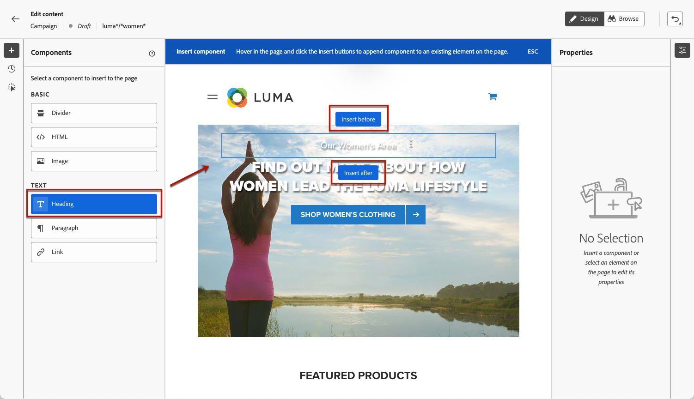
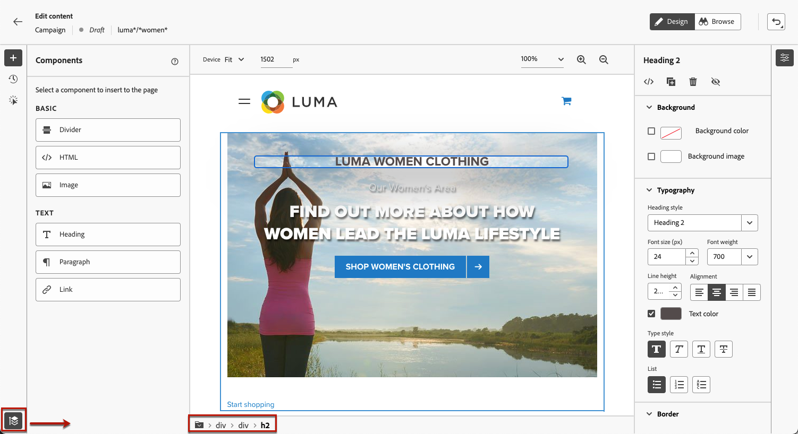

# Trabajar con el diseñador web {#work-with-web-designer}

<!--
>[!CONTEXTUALHELP]
>id="ajo_web_url_to_edit_surface"
>title="Confirm the URL to edit"
>abstract="Confirm the URL of the specific web page to use for editing the content that will be applied on the web configuration defined above. The web page must be implemented using the Adobe Experience Platform Web SDK."
>additional-url="https://experienceleague.adobe.com/docs/platform-learn/implement-web-sdk/overview.html" text="Learn more"

>[!CONTEXTUALHELP]
>id="ajo_web_url_to_edit_rule"
>title="Enter the URL to edit"
>abstract="Enter the URL of a specific web page to use for editing the content that will be applied to all pages matching the rule. The web page must be implemented using Adobe Experience Platform Web SDK."
>additional-url="https://experienceleague.adobe.com/docs/platform-learn/implement-web-sdk/overview.html" text="Learn more"
-->

En [!DNL Journey Optimizer], la creación web visual funciona con la extensión de explorador **Adobe Experience Cloud Visual Helper** Chrome. [Más información](web-prerequisites.md#visual-authoring-prerequisites)

>[!CAUTION]
>
>Para poder tener acceso y crear páginas web en la interfaz de usuario de [!DNL Journey Optimizer], asegúrese de cumplir los requisitos previos enumerados en [esta sección](web-prerequisites.md).

## Comience a crear su experiencia web

Para empezar a crear la experiencia web con el diseñador web visual, siga los pasos a continuación.

>[!CAUTION]
>
>[Adobe Experience Platform Web SDK](https://experienceleague.adobe.com/docs/platform-learn/implement-web-sdk/overview.html?lang=es){target="_blank"} debe incluirse en la página web. [Más información](web-prerequisites.md#implementation-prerequisites)

1. En la pantalla **[!UICONTROL Editar contenido]**, haga clic en **[!UICONTROL Editar página web]** para abrir el diseñador web.

   

   <!---->

   >[!NOTE]
   >
   >Si intenta cargar un sitio web que no se puede cargar, aparece un mensaje sugiriendo que instale la extensión de explorador [Ayuda de edición visual](#install-visual-editing-helper). Vea algunas sugerencias para solucionar problemas en [esta sección](web-prerequisites.md#troubleshooting).
   >
   >También puede editar el contenido web sin cargar el editor visual. Para ello, anule la selección de la opción **[!UICONTROL Editor visual]** para usar el modo de edición no visual en su lugar. [Más información](web-non-visual-editor.md)

1. Una vez en el diseñador web, seleccione cualquier elemento del lienzo, como imagen, botón, párrafo, texto, contenedor, encabezado, vínculo, etc. [Más información](#content-components)

1. Para editar un elemento, puede utilizar:

   * Menú contextual para editar su contenido, diseño, inserción de vínculos o personalización, etc.

     

   * Los iconos de la parte superior del panel derecho para editar, duplicar, eliminar u ocultar cada elemento.

     

   * Panel derecho que cambia dinámicamente según el elemento seleccionado. Por ejemplo, puede editar el fondo, la tipografía, el borde, el tamaño, la posición, el espaciado, los efectos o los estilos en línea de un elemento.

     

>[!NOTE]
>
>El diseñador de contenido web es muy similar al Designer de correo electrónico. Más información sobre [diseñar contenido con [!DNL Journey Optimizer]](../email/get-started-email-design.md).

Una vez editado el contenido web, puede administrar las modificaciones. [Más información](manage-web-modifications.md)

## Uso de componentes {#content-components}

>[!CONTEXTUALHELP]
>id="ajo_web_designer_components"
>title="Añadir componentes a la página web"
>abstract="Puede añadir varios componentes a la página web y editarlos según sea necesario."

1. En el panel **[!UICONTROL Componentes]** de la izquierda, seleccione un elemento. Puede añadir los siguientes componentes a la página web y editarlos según sea necesario:

   * [Divisor](../email/content-components.md#divider)
   * [HTML](../email/content-components.md#HTML)
   * [Imagen](../email/content-components.md#image)
   * Encabezado: El uso de este componente es similar al uso del componente **[!UICONTROL Text]** en el Designer de correo electrónico. [Más información](../email/content-components.md#text)
   * Párrafo: El uso de este componente es similar al uso del componente **[!UICONTROL Texto]** en el Designer de correo electrónico. [Más información](../email/content-components.md#text)
   * Vínculo

   

1. Pase el ratón sobre la página y haga clic en el botón **[!UICONTROL Insertar antes]** o **[!UICONTROL Insertar después]** para anexar el componente a un elemento existente de la página.

   

   >[!NOTE]
   >
   >Para anular la selección de un componente, haga clic en el botón **[!UICONTROL ESC]** en el titular azul contextual que se muestra en la parte superior del lienzo.

1. Edite el componente según sea necesario directamente en el contenido de la página.

   

1. Ajuste los estilos que se muestran en el panel contextual de la derecha, como fondo, color del texto, borde, tamaño, posición, etc. - según el componente seleccionado.

   

## Adición de personalización

Para añadir personalización, seleccione un contenedor y seleccione el icono de personalización de la barra de menús contextual que se muestra. Añada los cambios con el editor de personalización. [Más información](../personalization/personalization-build-expressions.md)

## Navegar por el diseñador web {#navigate-web-designer}

En esta sección se detallan las distintas formas de desplazarse por el diseñador web. Para ver y administrar las modificaciones agregadas a su experiencia web, vea [esta sección](manage-web-modifications.md).

### Usar rutas {#breadcrumbs}

1. Seleccione cualquier elemento del lienzo.

1. Haga clic en el botón **[!UICONTROL Expandir/contraer rutas]** en la parte inferior izquierda de la pantalla para mostrar rápidamente información sobre el elemento seleccionado.

   

1. Cuando pasa el ratón por encima de las rutas de exploración, el elemento correspondiente se resalta en el editor.

1. Puede navegar fácilmente a cualquier elemento principal, del mismo nivel o secundario dentro del editor visual.

### Cambiar al modo Examinar {#browse-mode}

>[!CONTEXTUALHELP]
>id="ajo_web_designer_browse"
>title="Usar el modo Examinar"
>abstract="Desde este modo, puede desplazarse a la página exacta desde la configuración seleccionada que desee personalizar."

Puede cambiar del modo predeterminado **[!UICONTROL Diseño]** al modo **[!UICONTROL Examinar]** con el botón dedicado.

Desde el modo **[!UICONTROL Examinar]**, puede navegar a la página exacta desde la configuración seleccionada que desee personalizar.

Resulta especialmente útil cuando se tratan páginas que están detrás de la autenticación o que no están disponibles desde el principio en una dirección URL determinada. Por ejemplo, podrá autenticarse, navegar a la página de su cuenta o a la página de su carro de compras y, a continuación, cambiar al modo **[!UICONTROL Diseño]** para realizar los cambios en la página deseada.

El uso del modo **[!UICONTROL Examinar]** también le permite navegar por todas las vistas del sitio web al crear aplicaciones de una sola página. [Más información](web-spa.md)

### Cambiar el tamaño del dispositivo {#change-device-size}

Puede cambiar el tamaño del dispositivo de visualización del diseñador web a un tamaño predefinido como **[!UICONTROL Tablet]** o **[!UICONTROL horizontal móvil]**, o definir un tamaño personalizado introduciendo el número deseado de píxeles.

También puede cambiar el enfoque del zoom: de 25% a 400%.

La capacidad de cambiar el tamaño del dispositivo está diseñada para sitios adaptables que se renderizan bien en varios dispositivos, ventanas y tamaños de pantalla. Los sitios adaptables se ajustan y adaptan automáticamente a cualquier tamaño de pantalla, incluidos escritorios, portátiles, tabletas o teléfonos móviles.

>[!CAUTION]
>
>Puede editar una experiencia web con un tamaño de dispositivo específico. Sin embargo, siempre que los selectores sean los mismos, estos cambios se aplican a todos los tamaños y dispositivos, no solo al tamaño del dispositivo en el que está trabajando. Del mismo modo, si edita una experiencia en la vista de escritorio normal, los cambios se aplican a todos los tamaños de pantalla, no solo a la vista de escritorio.
>
>Actualmente, [!DNL Journey Optimizer] no admite cambios de página específicos de tamaño de dispositivo. Esto significa que, por ejemplo, si tiene un sitio web móvil independiente con otra estructura de sitio, debe realizar los cambios específicos del sitio móvil en una campaña diferente.

## Vídeo práctico{#video}

El siguiente vídeo muestra cómo crear una experiencia web con el diseñador web en [!DNL Journey Optimizer] campañas.

>[!VIDEO](https://video.tv.adobe.com/v/3418803/?quality=12&learn=on)
