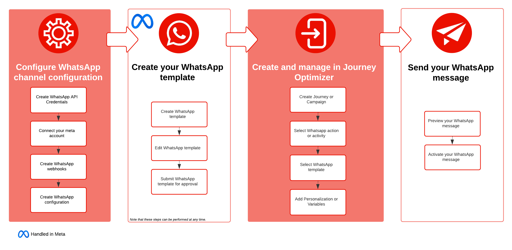

# Introducción a los mensajes de WhatsApp {#get-started-whatsapp}

>[!BEGINSHADEBOX]

**Tabla de contenido**

* **[Introducción a los mensajes de WhatsApp](get-started-whatsapp.md)**
* [Introducción a la configuración de WhatsApp](whatsapp-configuration.md)
* [Crear un mensaje de WhatsApp](create-whatsapp.md)
* [Comprueba y envía tus mensajes de WhatsApp](send-whatsapp.md)

>[!ENDSHADEBOX]

>[!AVAILABILITY]
>
>Esta capacidad se presenta como una versión beta privada. Estará disponible de forma progresiva para todos los clientes en futuras versiones.

Ahora puede enviar mensajes de WhatsApp directamente a través de Journey Optimizer. Esta función permite la integración perfecta de WhatsApp en recorridos y campañas, lo que mejora la comunicación y la participación con los destinatarios.

* En un **recorrido**. Crea un recorrido, agrega una actividad **WhatsApp**, define la configuración básica y luego ve al panel derecho **[!UICONTROL Acciones: WhatsApp]** para crear el contenido del mensaje de WhatsApp. Aprenda a crear un recorrido en [esta página](../building-journeys/journey-gs.md)

* En una **campaña**. Crea una campaña, selecciona **WhatsApp** como acción y define la configuración básica; luego, edita el contenido del mensaje para definir el mensaje de WhatsApp que se enviará. Aprenda a crear una campaña en [esta página](../campaigns/create-campaign.md#configure).

{zoomable="yes"}

## Requisitos previos {#prereq}

La integración de WhatsApp con Journey Optimizer requiere lo siguiente:

* Cuenta de Meta Business Manager
* Cuenta de WhatsApp Business
* Número de teléfono de WhatsApp

También debe tener en cuenta lo siguiente antes de continuar con la integración:

* [Reglas de contenido de WhatsApp](https://www.whatsapp.com/legal/messaging-guidelines)
* [Cumplimiento de las metapolíticas](https://www.whatsapp.com/legal)
* [Límites para las conversaciones de 24 horas](https://developers.facebook.com/docs/whatsapp/messaging-limits/)
* [Plantillas de metadatos aprobadas](https://developers.facebook.com/docs/whatsapp/message-templates/guidelines/)

## Limitaciones de Beta {#limitations}

Las siguientes funciones no se incluirán en esta versión beta:

* **Informes**: La capacidad para generar y ver informes no estará disponible en esta versión.

* **Palabras clave de inclusión/exclusión**: los usuarios no tendrán la opción de suscribirse o cancelar la suscripción con palabras clave específicas en este momento.

* **Mensajes de respuesta**: no se admitirán mensajes de respuesta automatizados o predefinidos en esta versión.

## Vídeo práctico {#video}

El siguiente vídeo muestra cómo crear un recorrido con una acción de WhatsApp.

+++ Ver vídeo

>[!VIDEO](https://video.tv.adobe.com/v/3451621?learn=on)

+++
