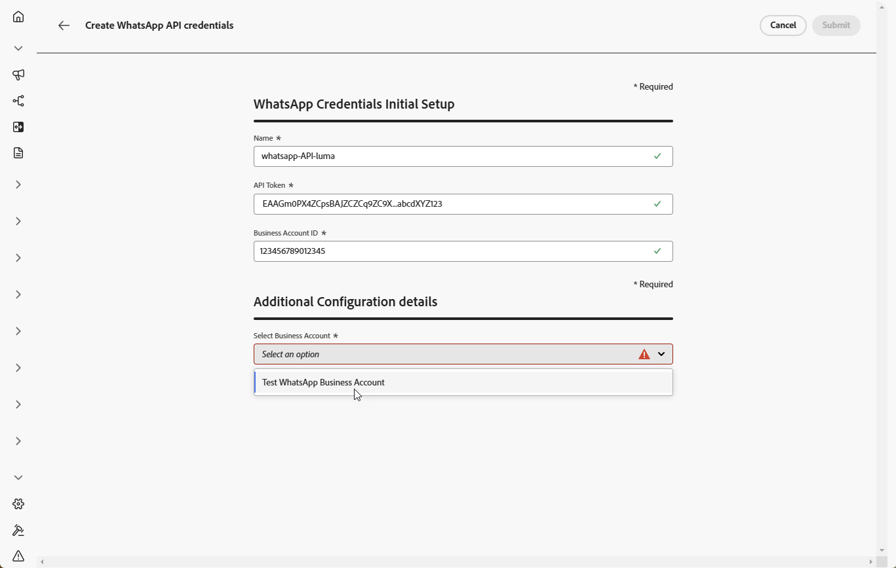
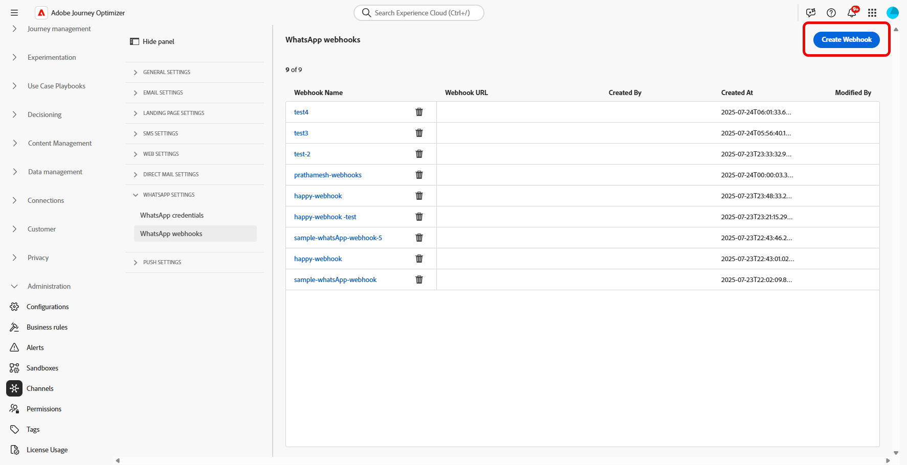
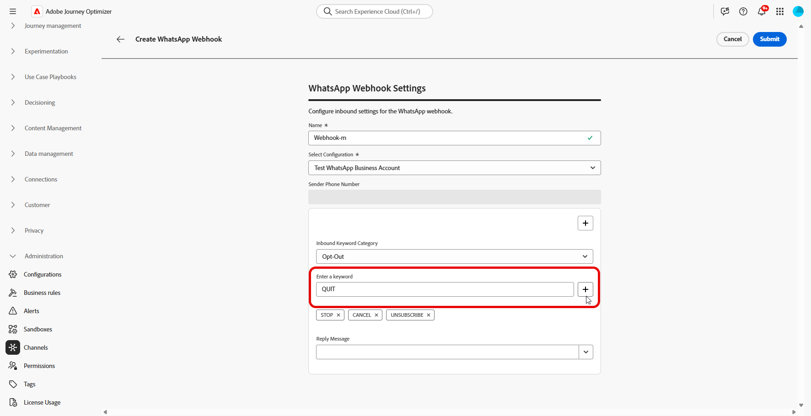
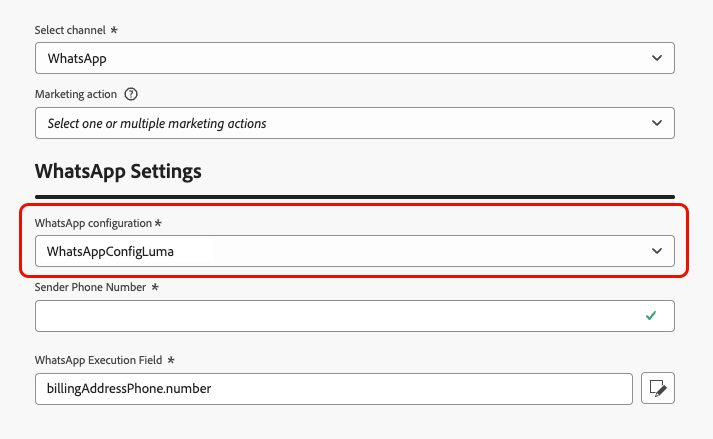

# Introducción a la configuración de WhatsApp {#whatsapp-config}

Antes de enviar tu mensaje de WhatsApp, debes configurar tu entorno de Adobe Journey Optimizer y asociarlo a tu cuenta de WhatsApp. Para realizar esto:

1. [Cree sus credenciales de la API de WhatsApp](#WhatsApp-credentials)
1. [Crea tus webhooks de WhatsApp](#WhatsApp-webhook)
1. [Crea tu configuración de WhatsApp](#WhatsApp-configuration)

Estos pasos debe realizarlos un administrador del sistema [de Adobe Journey Optimizer](../start/path/administrator.md).

## Crear credenciales de API de WhatsApp {#whatsapp-credentials}

1. En el carril izquierdo, vaya a **[!UICONTROL Administración]** `>` **[!UICONTROL Canales]** y seleccione el menú **[!UICONTROL Credenciales de API]**. Haga clic en el botón **[!UICONTROL Crear nuevas credenciales de API]**.

1. Configure las credenciales de la API como se detalla a continuación:

   * **Token de API**: escriba el token de API. Obtenga más información en [Documentación de Meta](https://developers.facebook.com/blog/post/2022/12/05/auth-tokens/)
   * **ID de cuenta empresarial**: escriba el número único relacionado con su portafolio empresarial. Obtenga más información en [Documentación de Meta](https://www.facebook.com/business/help/1181250022022158?id=180505742745347).

   

1. Haga clic en **[!UICONTROL Continuar]**.

1. Elige la **cuenta comercial de WhatsApp** a la que deseas conectarte con tus credenciales de la API de WhatsApp.

   

1. Selecciona el **nombre del remitente** que se usa para enviar tus mensajes de WhatsApp.

1. La configuración de tu número de teléfono se completa automáticamente:

   * **Clasificación de calidad**: refleja los comentarios de los clientes sobre los mensajes enviados en las últimas 24 horas.
      * Verde: alta calidad
      * Amarillo: calidad Medium
      * Rojo: baja calidad

     Más información sobre [Clasificación de calidad](https://www.facebook.com/business/help/766346674749731#)

   * **Rendimiento**: indica la velocidad a la que su número de teléfono puede enviar mensajes.

1. Haga clic en **[!UICONTROL Enviar]** cuando termine de configurar las credenciales de la API.

Después de crear y configurar sus credenciales de API, ahora debe crear su webhook para mensajes de WhatsApp. [Más información](#whatsapp-webhook)

## Crear webhook {#WhatsApp-webhook}

>[!CONTEXTUALHELP]
>id="ajo_admin_whatsapp_webhook_inbound_keyword_category"
>title="Categoría de palabra clave entrante"
>abstract="<b>Inclusión</b>: envía la respuesta automática definida cuando un usuario se suscribe.  <b>Exclusión</b>: envía la respuesta automática definida cuando un usuario cancela la suscripción.  <b>Ayuda</b>: envía la respuesta automática definida cuando un usuario solicita ayuda o soporte técnico.  <b>Predeterminado</b>: envía su respuesta automática de reserva cuando no coinciden las palabras clave."

>[!CONTEXTUALHELP]
>id="ajo_admin_whatsapp_webhook_inbound_keyword"
>title="Introduzca sus palabras clave"
>abstract="Puede definir palabras clave para activar respuestas automáticas específicas en función del texto que escriban los usuarios. Las palabras clave no distinguen entre mayúsculas y minúsculas; por ejemplo, stop y STOP se tratan igual."

>[!CONTEXTUALHELP]
>id="ajo_admin_whatsapp_webhook_webhook_url"
>title="URL de devolución de llamada"
>abstract="La solicitud de validación y las notificaciones del webhook para este objeto se envían a la dirección URL especificada."

>[!CONTEXTUALHELP]
>id="ajo_admin_whatsapp_webhook_verify_token"
>title="Verificar token"
>abstract="El token que Meta devuelve para confirmar y verificar la URL de devolución de llamada durante el proceso de verificación."

>[!NOTE]
>
>Sin las palabras clave de inclusión u exclusión especificadas, no se habilitan los mensajes de consentimiento estándar.

Una vez que las credenciales de la API de WhatsApp se hayan creado correctamente, ahora puede configurar los Webhooks para capturar las respuestas entrantes para administrar el consentimiento de inclusión y exclusión, y para recibir informes de entrega, incluidas las confirmaciones de lectura, cuando estén disponibles.

1. En el carril izquierdo, vaya a **[!UICONTROL Administración]** `>` **[!UICONTROL Canales]**, seleccione el menú **[!UICONTROL Webhooks de WhatsApp]** en **[!UICONTROL Configuración de WhatsApp]** y haga clic en el botón **[!UICONTROL Crear webhook]**.

   

1. Escribe un **[!UICONTROL Nombre]** para tu webhook.

1. En el menú desplegable **[!UICONTROL Seleccionar configuración]**, seleccione las [Credenciales de API](#whatsapp-credentials) que creó anteriormente.

   

1. Elija su **[!UICONTROL categoría de palabras clave de entrada]**, como:

   * **[!UICONTROL Palabras clave de inclusión]**
   * **[!UICONTROL Palabras clave de exclusión]**
   * **[!UICONTROL Palabras clave de ayuda]**

1. Escriba sus **[!UICONTROL palabras clave]** y haga clic en .

   

1. En el campo **[!UICONTROL Mensaje de respuesta]**, escriba el mensaje enviado cuando reciba una palabra clave configurada o seleccione una opción predefinida en el menú desplegable.

   

<!--
1. Click **[!UICONTROL View payload editor]** to validate and customize your request payloads. 
    
    You can dynamically personalize your payload using profile attributes, and ensure accurate data is sent for processing and response generation with the help of built-in helper functions.
-->
1. Haga clic en  para agregar **[!UICONTROL palabra clave entrante adicional]**.

1. Haz clic en **[!UICONTROL Enviar]** cuando hayas terminado la configuración de tu webhook de WhatsApp.

1. En el menú de **[!UICONTROL Webhooks]**, haz clic en el  para eliminar tu webhook de WhatsApp.

   

1. Para modificar la configuración existente y acceder a tu **[!UICONTROL URL de webhook]** o **[!UICONTROL Herramienta de verificación de webhook]**, localiza el webhook deseado y haz clic en la opción **[!UICONTROL Editar]** para realizar los cambios necesarios.

1. Copie la **[!UICONTROL Herramienta de verificación de webhook]** que se generó aquí y péguela en la interfaz de Meta como parte de la configuración de webhook.

   Para obtener instrucciones detalladas sobre cómo y dónde agregar este token de verificación, consulte [Documentación de Meta](https://developers.facebook.com/docs/graph-api/webhooks/getting-started#configure-webhooks-product).

1. Accede y copia tu nueva **[!UICONTROL URL de webhook]** desde tu **[!UICONTROL webhook de WhatsApp]** enviado anteriormente.

   

Ahora que tu webhook está configurado, puedes crear tu configuración de WhatsApp.

## Crear configuración de WhatsApp {#whatsapp-configuration}

1. En el carril izquierdo, vaya a **[!UICONTROL Administración]** > **[!UICONTROL Canales]** y seleccione **[!UICONTROL Configuración general]** > **[!UICONTROL Configuraciones de canal]**. Haga clic en el botón **[!UICONTROL Crear configuración de canal]**.

   

1. Introduzca un nombre y una descripción (opcional) para la configuración y, a continuación, seleccione el canal de WhatsApp.

   >[!NOTE]
   >
   > Los nombres deben comenzar por una letra (A-Z). Solo puede contener caracteres alfanuméricos. También puede utilizar caracteres de guion bajo `_`, punto `.` y guion `-`.

1. Seleccione **[!DNL WhatsApp]** como su canal.

   {width=80%}

1. Seleccione **[!UICONTROL Acciones de marketing]** para asociar directivas de consentimiento a los mensajes que usan esta configuración. Todas las políticas de consentimiento asociadas con la acción de marketing se aprovechan para respetar las preferencias de los clientes. [Más información](../action/consent.md#surface-marketing-actions)

1. En la sección **[!UICONTROL Configuración de WhatsApp]**, selecciona la **[!UICONTROL configuración de WhatsApp]** creada anteriormente.

   {width=80%}

1. Escriba el **[!UICONTROL número de teléfono del remitente]** &#x200B;que desea usar para sus comunicaciones.

1. Use el **[!UICONTROL Campo de ejecución de WhatsApp]** para seleccionar entre los atributos de perfil el número de teléfono que desea usar como prioridad si hay varios números disponibles en la base de datos. [Más información](../configuration/primary-email-addresses.md#override-execution-address-channel-config)

   >[!NOTE]
   >
   >De manera predeterminada, [!DNL Journey Optimizer] usa el número de teléfono especificado en [configuración general](../configuration/primary-email-addresses.md) en el nivel de espacio aislado. Al actualizar este campo, se anula el valor predeterminado de los recorridos y campañas que utilizan esta configuración.

1. Una vez configurados todos los parámetros, haga clic en **[!UICONTROL Enviar]** para confirmar. También puede guardar la configuración de canal como borrador y reanudarla más adelante.

1. Una vez creada la configuración del canal, se muestra en la lista con el estado **[!UICONTROL Procesando]**.

   >[!NOTE]
   >
   >Si las comprobaciones no se realizan correctamente, obtenga más información sobre los posibles motivos de error en [esta sección](../configuration/channel-surfaces.md).

1. Una vez que las comprobaciones son correctas, la configuración del canal obtiene el estado **[!UICONTROL Activo]**. Está listo para utilizarse para enviar mensajes.

Una vez configuradas, puede aprovechar todas las funcionalidades de canal integradas, como la creación de mensajes, la personalización, el seguimiento de vínculos y la creación de informes.

Ya estás listo para enviar mensajes de WhatsApp con Journey Optimizer.

## Vídeo práctico {#video}

El siguiente vídeo muestra cómo configurar el canal de WhatsApp en Adobe Journey Optimizer.

+++ Vea el vídeo

>[!VIDEO](https://video.tv.adobe.com/v/3470271/?captions=spa&learn=on)

+++
